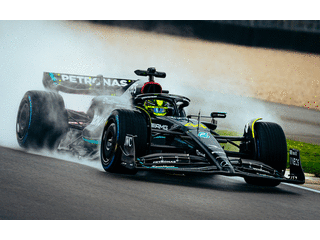
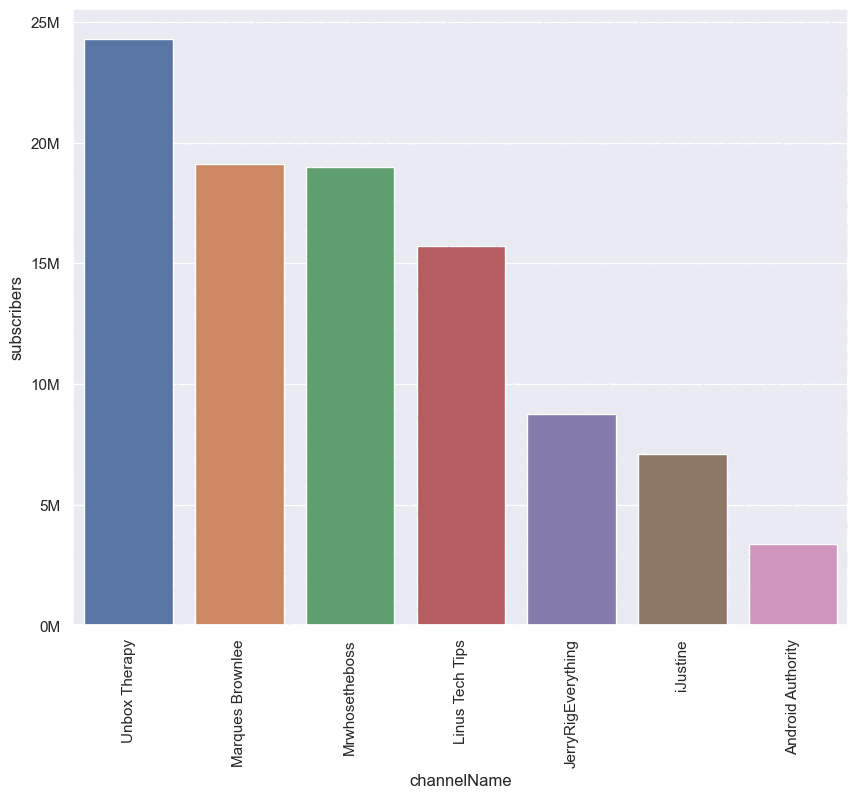
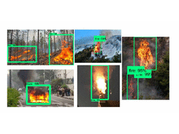
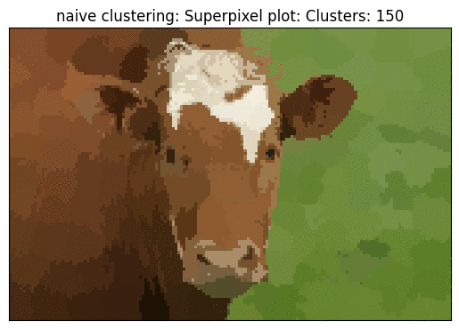
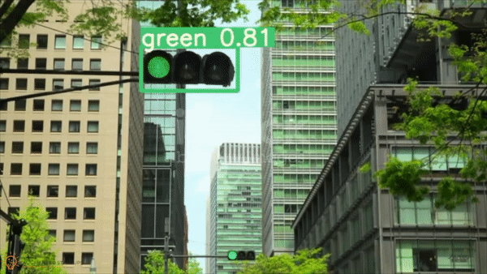
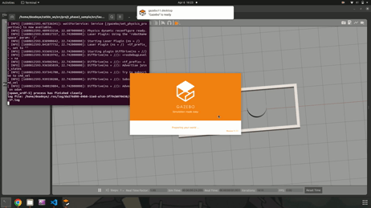

<h1 align="center">Hi </h1>

### :woman_technologist: &nbsp;About Me :

I am Satish Vennapu, an ML and AI developer  from India in the United States.

- 🔭 I’m working on Computer Vision and Deep Learning algorithms.
- 👀 I’m interested in Robotics, Data Science, Artificial Intelligence, Automobiles, and technology.
- 🌱 Exploring software development, Deep Learning Algorithms
- ⚡ In my free time I solve problems on Leetcode, create business ideas, and read tech articles.
- 📫 You can reach me at: &nbsp; 

---

### 🛠 &nbsp;Languages and Tools :

&nbsp;
&nbsp;
&nbsp;
&nbsp;
&nbsp;
&nbsp;
&nbsp;
&nbsp;
&nbsp;
&nbsp;
&nbsp;
&nbsp;
&nbsp;
&nbsp;
&nbsp;

---
### :clamp: &nbsp; Projects
Click on the images to take you to the respective projects

[</img>](https://github.com/Satish-Vennapu/F1-Race_Predictor)
[</img>](https://github.com/Satish-Vennapu/HPE-for-HAR)
[</img>](https://github.com/Satish-Vennapu/YouTube-Analysis)
[</img>](https://github.com/Satish-Vennapu/EarlyWildfire-Detection-and-Segmentation-Using-Xception-Lite-U-Net)
[</img>](https://github.com/Satish-Vennapu/Superpixels)
[</img>](https://github.com/Satish-Vennapu/Traffic-Light-Detection-using-YOLOv8)
[</img>](https://github.com/Satish-Vennapu)
[</img>](https://github.com/Satish-Vennapu/A-Star-with-Non-Holonomic-Constraints)
[</img>](https://github.com/Satish-Vennapu/Improved-RRT-Connect)
[</img>](https://github.com/Satish-Vennapu/Autonomous-Mobile-Robot)

---

### 🔥 &nbsp; My Stats :

---

<!--
**Satish-Vennapu/Satish-Vennapu** is a ✨ _special_ ✨ repository because its `README.md` (this file) appears on your GitHub profile.

-->
